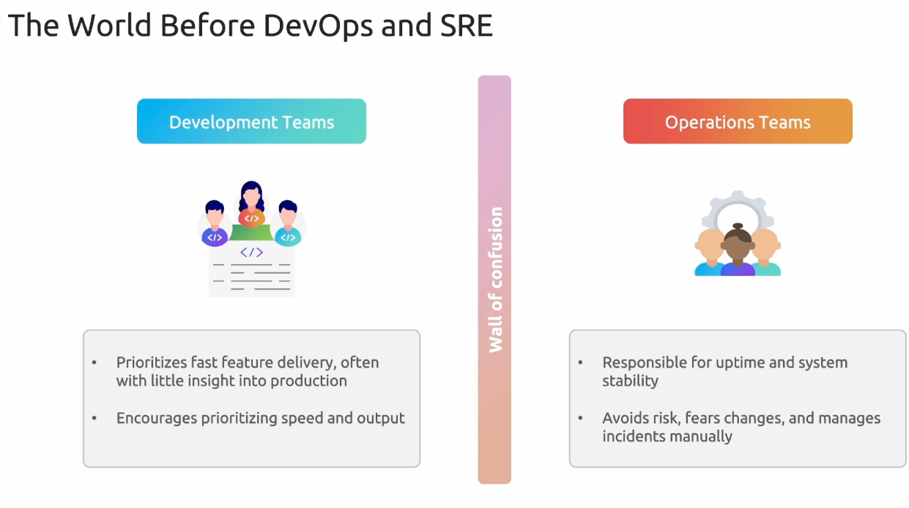
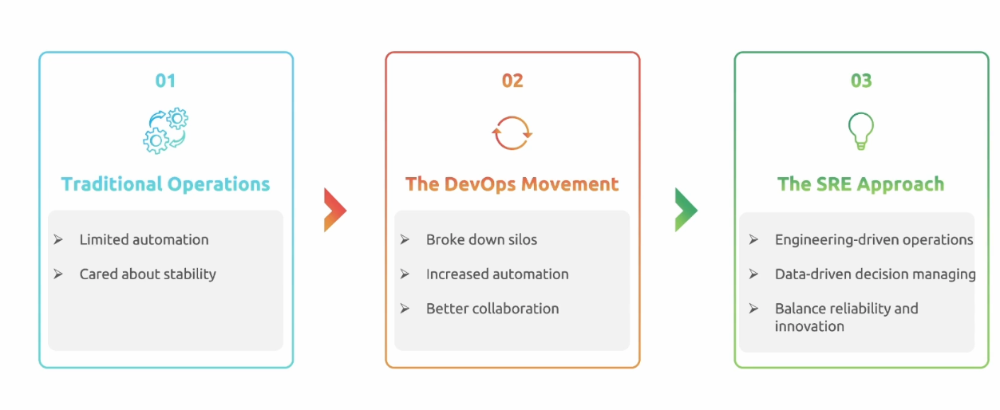
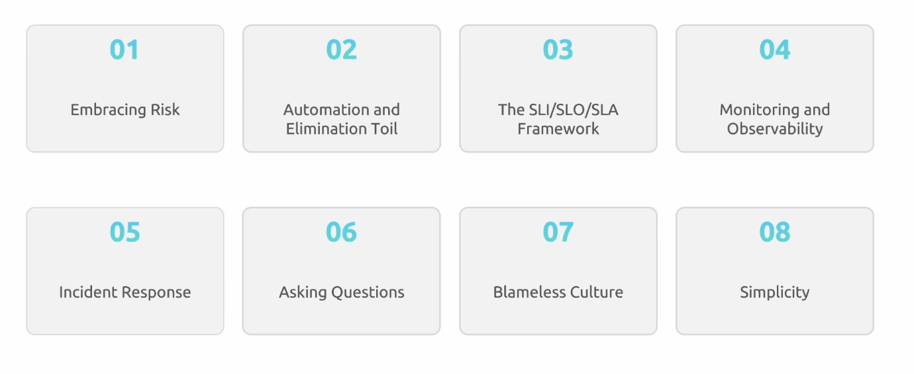
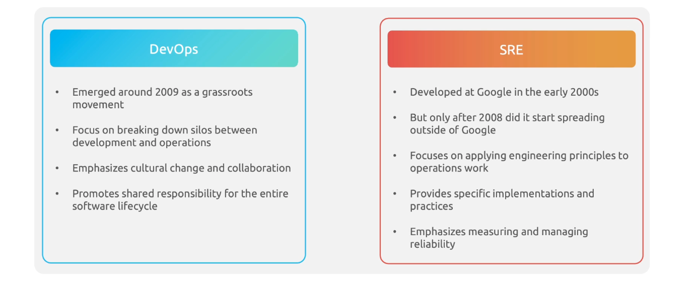
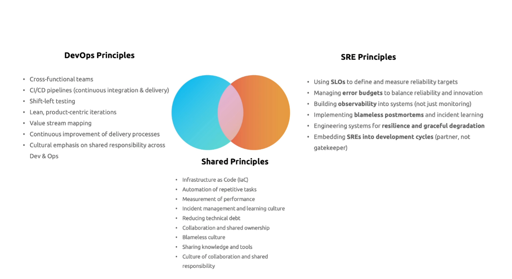

# Fundamentals of SRE

- Before Devops and SRE, developers and operations teams were separate. Developers would write code and then throw it over the wall to operations to deploy and maintain. This often led to communication issues, delays, and a lack of accountability for the reliability of the software. `It works on my machine` was a common phrase that highlighted the disconnect between development and operations.

- SRE pioneered by Google.

## SRE Key Principles

## DEvops vs SRE

- **DevOps is a cultural philosophy for delivering software faster and more collaboratively; SRE is its concrete implementation focused on reliability through engineering practices.**
